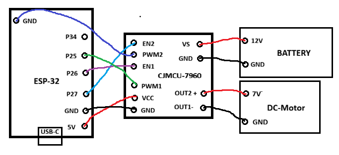

Motor controll
===============

On this page we will walk through what type of components we used in the assembly of the DC motor system. How it works and how we have 
connected the pins to each controller. 

   Representation as the circuit analysis for motorcontroll